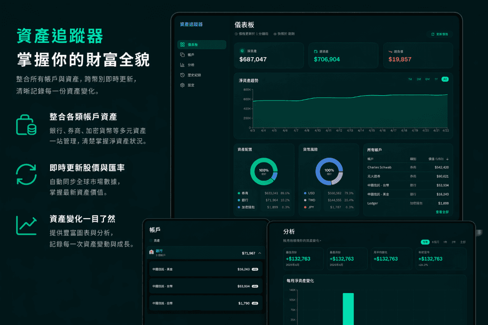

# 💰 Assets Tracker

A modern, high-performance net worth and investment tracker. Built with **Next.js 16**, **Prisma**, and **Tailwind CSS**.



## ✨ Features

- **🔐 Google OAuth**: Secure multi-user authentication via NextAuth.js v5.
- **🚀 Real-time Tracking**: Automatically fetch latest prices for Stocks, ETFs, Cryptocurrencies, and Options (via Yahoo Finance + CoinGecko fallback).
- **🌍 Multi-Currency Support**: Track assets in USD, TWD, EUR, and more. All values are automatically converted to your selected **Base Currency**.
- **📈 Analysis & Charts**: Interactive charts for net-worth trend, assets/liabilities breakdown, monthly cash flow, top movers, and currency exposure.
- **🔭 FIRE Projection**: Retirement projection page showing estimated FIRE date and portfolio growth curves from your real savings history.
- **🔄 Lossless History**: Snapshots store original account balances and currencies, allowing perfectly accurate history normalization even if you change your base currency later.
- **🤖 Automated Snapshots**: Built-in Vercel Cron integration to automatically record your net worth daily.
- **🌗 Light / Dark / System Theme**: Full theme support, plus multiple color schemes (chooseable from Settings).
- **💼 Unified Portfolio**: Combine bank accounts, brokerages, crypto wallets, and options positions into one dashboard.
- **⌨️ Keyboard-First Desktop**: Command palette (⌘K / Ctrl+K), Vim-style navigation chords, and configurable shortcuts for power users.
- **📱 Native Mobile Feel**: iOS large-title navigation, swipe actions on list rows, bottom-sheet dialogs, pull-to-refresh, and haptic feedback.
- **🌐 Internationalization**: English (en-US) and Traditional Chinese (zh-TW), auto-detected from browser.
- **📊 Lossless Data Integrity**: Detailed breakdown of historical snapshots ensuring currency conversion accuracy over time.

## 🛠️ Tech Stack

- **Framework**: Next.js 16 (App Router, React Server Components)
- **Database**: PostgreSQL via Prisma 7 (Neon serverless adapter)
- **Auth**: NextAuth.js v5 (Google OAuth, JWT sessions)
- **Styling**: Tailwind CSS 4 + shadcn/ui v4
- **i18n**: next-intl
- **Icons**: Lucide React
- **Charts**: Recharts
- **Validation**: Zod 4

## 🚀 Getting Started

### 1. Prerequisites

- Node.js 24.x (required by Next.js 16)
- A [Neon](https://neon.tech) PostgreSQL database (or any PostgreSQL with a Neon-compatible connection string)
- A Google OAuth app (for authentication)

### 2. Environment Variables

Create a `.env` file in the root directory:

```env
DATABASE_URL="your_neon_postgresql_connection_string"
AUTH_SECRET="your_secure_random_string"
AUTH_GOOGLE_ID="your_google_oauth_client_id"
AUTH_GOOGLE_SECRET="your_google_oauth_client_secret"
CRON_SECRET="your_secure_random_string"

# Preview-only (required when VERCEL_ENV=preview):
# PREVIEW_AUTH_PASSWORD="shared_password_to_gate_preview_access"
# PREVIEW_AUTH_DISABLED="true"  # optional, disables preview password gate
# AUTH_REDIRECT_PROXY_URL="https://stable-preview-host.vercel.app"  # optional, for Google OAuth on preview URLs
```

> [!TIP]
> Generate `AUTH_SECRET` and `CRON_SECRET` with `openssl rand -base64 32`.

### 3. Installation

```bash
corepack enable     # pins the pnpm version declared in package.json
pnpm install
pnpm exec prisma generate
pnpm exec prisma migrate deploy   # apply committed migrations to your database
```

> [!NOTE]
> For brand-new schema changes during local development, use `pnpm exec prisma migrate dev --name <description>` to generate a new migration file. `prisma db push` is still useful for quick prototyping but bypasses migration history; commit a migration before pushing the change.

### 4. Running Locally

We recommend using a local PostgreSQL database via Docker for development to avoid incurring Neon compute costs.

1. **Start the local database:**

   ```bash
   pnpm db:up
   ```

2. **Push the schema to your local DB:**

   ```bash
   pnpm exec prisma db push
   ```

3. **Start the development server:**
   ```bash
   pnpm dev
   ```

Open [http://localhost:3000](http://localhost:3000) to see your dashboard.

When you are done developing for the day, you can stop the database with `pnpm db:down`.

> [!TIP]
> **Resetting the Local Database**: If you need to clear all data and rebuild the database schema from scratch, run `pnpm exec prisma db push --force-reset`. Avoid using `pnpm exec prisma migrate reset` locally, as the repository does not have a baseline migration file (it relies on `db push` for schema sync) and the command will fail.

### 5. Tests

**Unit tests (Vitest).** A fast, DB-free suite lives in `tests/unit/`, covering the pure service-layer logic — net-worth two-pass valuation, exchange-rate resolution, history normalize/dedupe, analysis aggregations, serializers, and Zod validators. Server-only/DB modules are exercised through their real public functions with their dependencies mocked, so no database or env vars are needed.

```bash
pnpm test:unit        # Run once (headless)
pnpm test:unit:watch  # Watch mode
```

**End-to-end tests (Playwright).** A suite lives in `tests/e2e/`. The global setup provisions a dedicated test user so runs don't pollute real data.

```bash
pnpm test:e2e         # Run headless
pnpm test:e2e:ui      # Open the Playwright UI runner
pnpm test:e2e:report  # Open the last HTML report
```

## 🌳 Git Worktrees (parallel dev / AI agents)

When you want to work on several branches in parallel — or hand a branch to an AI agent in an isolated sandbox — use git worktrees with the bundled setup script. pnpm keeps a single global **content-addressable store** and builds each worktree's `node_modules` from **hardlinks** into it, so every worktree gets a real `node_modules` while package files are never duplicated on disk and installs after the first are near-instant.

```bash
# 1. Create a worktree for the branch you want to work on
git worktree add ../asset_tracker-<task-name> -b <branch-name>
cd ../asset_tracker-<task-name>

# 2. Install deps + auto-copy env files from the main worktree
pnpm setup:worktree

# 3. Develop as usual
pnpm dev
```

`setup:worktree`:

- Copies `.env` and `.env.local` from the main worktree on first run (won't overwrite — delete in the worktree to refresh; set `ASSET_TRACKER_SKIP_ENV_COPY=1` to opt out). This env-copy is the only thing the script does that pnpm can't.
- Runs `pnpm install --frozen-lockfile`. pnpm hardlinks `node_modules` from its shared global store (so packages are never duplicated across worktrees), and the `postinstall` (`prisma generate`) and `prepare` (`husky`) lifecycle scripts run automatically, so `src/generated/prisma/` and `.husky/_/` are always regenerated.
- Pass `--prune` to garbage-collect unreferenced packages from the store (`pnpm setup:worktree -- --prune`).

When the task is done:

```bash
cd ../asset_tracker             # back to the main checkout
git worktree remove ../asset_tracker-<task-name>
```

> [!TIP]
> pnpm uses one global store (default `~/.local/share/pnpm/store`) shared across all projects and worktrees, so dedup is automatic — no config needed for normal local dev. In ephemeral sandboxes/containers where `$HOME` isn't persisted across sessions, redirect the store to a persistent volume with pnpm's native setting, e.g. `export npm_config_store_dir=/persistent/pnpm-store` before installing (this is what `.codex/environments/environment_pnpm.toml` does, honoring `ASSET_TRACKER_CACHE_ROOT`). Hardlinks need the store and worktree on the same filesystem; if they differ, pnpm transparently falls back to copying (still correct, just less space-efficient).

> [!NOTE]
> Because each worktree now has its own real `node_modules`, you can run `pnpm add <pkg>` directly in a worktree — it updates `package.json` + `pnpm-lock.yaml` without affecting other worktrees.

## ✅ Verifying Locally

Steps to validate a fresh checkout end-to-end — these mirror what CI and Vercel run.

**1. Activate the pinned pnpm**

```bash
corepack enable
pnpm --version          # should print the version pinned in package.json (pnpm 11)
```

> If you still have a `node_modules` from an older npm setup, pnpm may ask to purge it once. Let it (`CI=true pnpm install` auto-confirms in non-interactive shells).

**2. Install + the CI check suite (no database needed)**

```bash
pnpm install --frozen-lockfile   # hardlinks from the shared store; runs prisma generate + husky
pnpm format:check
pnpm lint
pnpm typecheck
pnpm test:unit
```

**3. Production build**

```bash
pnpm build                       # uses your .env
```

No `.env`? Use the CI placeholders just to confirm it compiles:

```bash
DATABASE_URL="postgresql://ci:ci@localhost:5432/ci" \
AUTH_SECRET=x AUTH_GOOGLE_ID=x AUTH_GOOGLE_SECRET=x CRON_SECRET=x \
pnpm build
```

**4. Worktree flow (env-copy + install)**

```bash
git worktree add ../asset_tracker-pnpm-test -b tmp/pnpm-check
cd ../asset_tracker-pnpm-test
pnpm setup:worktree              # copies .env/.env.local from main, then pnpm install
ls -la node_modules              # a real directory (hardlinked from the store), not a symlink
cd ../asset_tracker
git worktree remove ../asset_tracker-pnpm-test
git branch -D tmp/pnpm-check
```

**5. (Optional) Inspect the shared store**

```bash
pnpm store path                  # global store location (default ~/.local/share/pnpm/store)
pnpm store status
```

Every worktree's `node_modules` hardlinks into this one store, so package files are stored once.

**6. (Optional) Run the app**

```bash
pnpm db:up
pnpm exec prisma db push
pnpm dev                         # http://localhost:3000
pnpm db:down                     # when done
```

> [!NOTE]
> `.nvmrc` pins Node 24. On a different version pnpm prints an `Unsupported engine` warning — harmless; run `nvm use` to match.

## 🔁 GitHub Actions policy (to control free-plan minutes)

This repository uses a **light-vs-heavy CI split**:

- **Pull requests**: run fast checks only (`format:check`, `lint`, `typecheck`, `test:unit`).
- **Push to `master`** (production merge path): run heavy checks (`build`).
- **Vercel preview deployments**: the Playwright `e2e` smoke suite runs against the live preview URL (`deployment_status` trigger; production deployments are skipped since they never render the preview-credentials login). Requires the `E2E_PASSWORD` repo secret to match `PREVIEW_AUTH_PASSWORD` on Vercel previews.
- **Docs-only / markdown-only changes** on push are skipped via workflow `paths-ignore`.
- Add `[skip ci]` to a commit message to skip push-triggered heavy jobs.
- Add `[skip ci]` to PR title/body to skip PR lint/typecheck jobs.

Workflow files:

- `.github/workflows/ci.yml`
- `.github/workflows/e2e.yml`

## 🤖 Automated Snapshots (Cron Jobs)

This project is optimized for **Vercel** and includes native Cron Job support via `vercel.json`.

- **Endpoint**: `/api/cron/snapshot`
- **Schedule**: Every day at 21:30 UTC (`30 21 * * *`, configured in `vercel.json`).
- **Security**: Protected via `CRON_SECRET` header verification.
- **Region**: Functions are pinned to `sin1` to colocate with the Neon database. If your Neon project lives in a different region, update `regions` in `vercel.json` to match.

To enable automation, deploy to Vercel and set all environment variables in your project settings. Vercel only runs cron jobs on production deployments, so preview deployments are unaffected.

### Preview deployments

Vercel preview deployments use a **separate Neon branch** so they never touch production data:

- Set `DATABASE_URL` with two scopes in Vercel → Settings → Environment Variables: one for **Production** (prod Neon branch) and one for **Preview** (a dedicated `preview` Neon branch). If your `DATABASE_URL` is managed by the Neon-Vercel integration, configure the per-environment branch mapping inside the integration UI instead.
- The Vercel build runs `pnpm run build:vercel`, which runs the idempotent `prisma migrate deploy` command before `next build`. Migration failures stop the deployment so a build cannot be published against a stale schema. `SKIP_PRISMA_MIGRATE_DEPLOY=1` remains an explicit emergency escape hatch.
- CI / local `pnpm build` is plain `next build` and does **not** require a database.

## 💹 Net Worth History & Currency Normalization

Tracking net worth across multiple currencies and time periods is complex. This project uses a **Lossless Snapshot** architecture to ensure your history remains accurate even if you change your base currency.

### 1. Snapshot Creation (`snapshot-service.ts`)

When a snapshot is taken (manually or via Cron), the system:

- Calculates your current net worth in your current **Base Currency**.
- Stores a **Lossless Breakdown** in a JSON field, recording every account's **original balance** and **original currency**.

### 2. History Normalization (`history-service.ts`)

When you view your history chart or table, the system:

- Fetches all historical snapshots for your user ID.
- Identifies your current preferred **Base Currency** from settings.
- **On-the-fly Conversion**: For each snapshot, it converts every account balance from its original currency to your current base currency using the **latest available exchange rates**.
- **Legacy Support**: If a snapshot was taken before the lossless system was implemented, it converts the snapshot's total value from its original base currency to your current one.

This approach ensures that your trend lines always remain continuous and comparable, regardless of currency fluctuations or setting changes.

## 🏷️ Versioning

The app follows [Semantic Versioning](https://semver.org). Version history lives in `src/lib/changelog.ts` (the single source of truth — the displayed version derives from the newest entry) and is shown in-app on the **`/changelog`** page and the Settings "Version" card. To cut a release, add an entry there and bump `package.json`'s `version`. See [VERSIONING.md](./docs/VERSIONING.md) for the bump rules and full process.

## 📄 License

MIT
