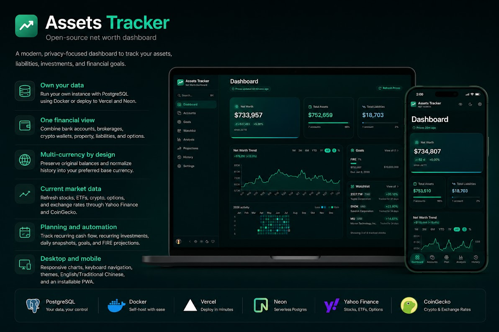
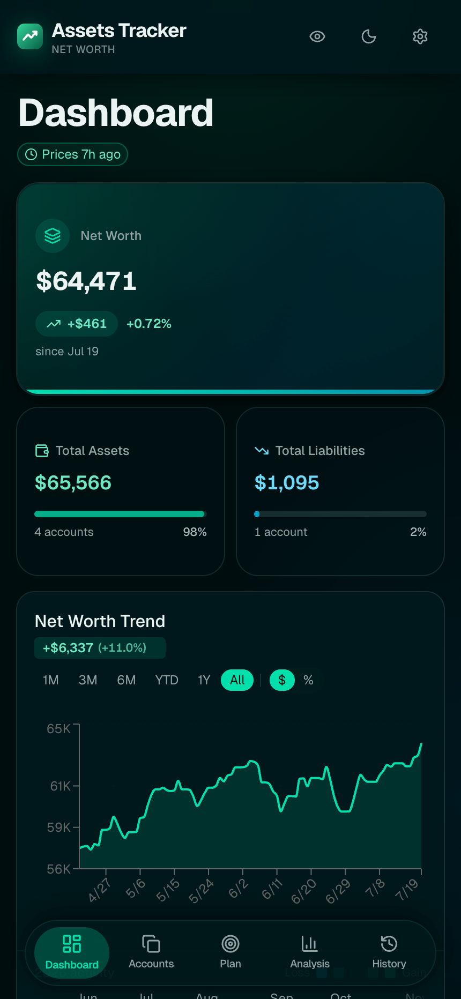

# astt

[](https://github.com/mike840609/assets_tracker/actions/workflows/ci.yml)
[](https://github.com/mike840609/assets_tracker/actions/workflows/e2e.yml?query=branch%3Amaster+event%3Apush)
[](https://github.com/mike840609/assets_tracker/releases/latest)
[](https://github.com/mike840609/assets_tracker/pkgs/container/assets_tracker)
[](./LICENSE)
[](./CONTRIBUTING.md)
[](https://deepwiki.com/mike840609/assets_tracker)

[English](./README.md) | [繁體中文](./README.zh-TW.md)

**Open-source, self-hosted net worth & portfolio tracker.**

A private, multi-currency home for tracking your net worth, investments, cash, property, liabilities, and long-term financial goals.

> Formerly Assets Tracker. Same project, now branded as **astt**.

[Live Demo](https://astt.app) · [Quick Start](#quick-start) · [Install with AI](#install-with-ai) · [Documentation](#documentation) · [Security](./SECURITY.md) · [Contributing](./CONTRIBUTING.md)



## Why astt?

- **Own your data** — run your own instance with PostgreSQL using Docker or deploy to Vercel and Neon.
- **One financial view** — combine bank accounts, brokerages, crypto wallets, property, liabilities, and options.
- **Multi-currency by design** — keep original balances and view history in your preferred base currency.
- **Current market data** — refresh stocks, ETFs, crypto, options, and exchange rates through Yahoo Finance and CoinGecko.
- **Planning and automation** — track recurring cash flow, recurring investments, daily snapshots, goals, and FIRE projections.
- **Desktop and mobile** — responsive UI, themes, English/Traditional Chinese, and an installable PWA.

## Demo

<table>
  <tr>
    <th width="70%">Desktop</th>
    <th width="30%">Mobile</th>
  </tr>
  <tr>
    <td></td>
    <td></td>
  </tr>
</table>

## Quick Start

For production self-hosting with Docker Compose:

```bash
cp .env.example .env
# Set the required production values in .env
docker compose --profile full pull
docker compose --profile full up --no-build -d
```

See [Deployment and Self-Hosting](./docs/DEPLOYMENT.md) for required environment variables, HTTPS, backups, upgrades, Vercel + Neon, and other production details.

Developing astt locally? See the [Development workflow](./docs/DEVELOPMENT.md).

## Install with AI

Prefer to let an AI coding agent handle the setup? Paste this prompt into your agent:

> Install astt by following the guide: https://raw.githubusercontent.com/mike840609/assets_tracker/master/docs/INSTALL_WITH_AI.md

The guide covers both local development and production self-hosting.

## How It Compares

<details>
<summary><b>How astt compares to Ghostfolio, Firefly III and Actual Budget</b></summary>

astt focuses on net worth and investments. If you mainly want double-entry bookkeeping or envelope budgeting, [Firefly III](https://github.com/firefly-iii/firefly-iii) and [Actual Budget](https://github.com/actualbudget/actual) are excellent at that — here is where each tool fits:

|                                         | astt                    | [Ghostfolio](https://github.com/ghostfolio/ghostfolio) | [Firefly III](https://github.com/firefly-iii/firefly-iii) | [Actual Budget](https://github.com/actualbudget/actual) |
| --------------------------------------- | ----------------------- | ------------------------------------------------------ | --------------------------------------------------------- | ------------------------------------------------------- |
| Primary focus                           | Net worth + investments | Investment portfolio                                   | Bookkeeping & budgets                                     | Envelope budgeting                                      |
| Live market data (stocks, ETFs, crypto) | ✅                      | ✅                                                     | —                                                         | —                                                       |
| Options positions                       | ✅                      | —                                                      | —                                                         | —                                                       |
| Multi-currency accounts & history       | ✅                      | ✅                                                     | ✅                                                        | —                                                       |
| Recurring rules                         | ✅ cash + DCA investing | —                                                      | ✅ cash                                                   | ✅ cash                                                 |
| Goals & FIRE projections                | ✅                      | ✅                                                     | —                                                         | —                                                       |
| Budgeting / double-entry ledger         | —                       | —                                                      | ✅                                                        | ✅                                                      |
| License                                 | MIT                     | AGPL-3.0                                               | AGPL-3.0                                                  | MIT                                                     |

<sub>Summarized from each project's public documentation as of July 2026 — check their sites for the latest.</sub>

</details>

## Documentation

- [Install with an AI agent](./docs/INSTALL_WITH_AI.md)
- [Deployment and self-hosting](./docs/DEPLOYMENT.md)
- [Development workflow](./docs/DEVELOPMENT.md)
- [Architecture](./docs/ARCHITECTURE.md)
- [Database and migrations](./docs/DATABASE.md)
- [CI policy](./docs/CI.md)
- [Versioning](./docs/VERSIONING.md)
- [Environment variable reference](./.env.example)

## Support and Security

Use [GitHub Issues](https://github.com/mike840609/assets_tracker/issues) for reproducible bugs and feature requests. Report vulnerabilities privately through the [Security Policy](./SECURITY.md).

## Data Responsibility

astt is personal-tracking software, not financial, tax, or investment advice. Self-hosters are responsible for securing their deployment, data, backups, credentials, and access controls.

## License

Licensed under the [MIT License](./LICENSE) © 2026 Mike Tsai.
