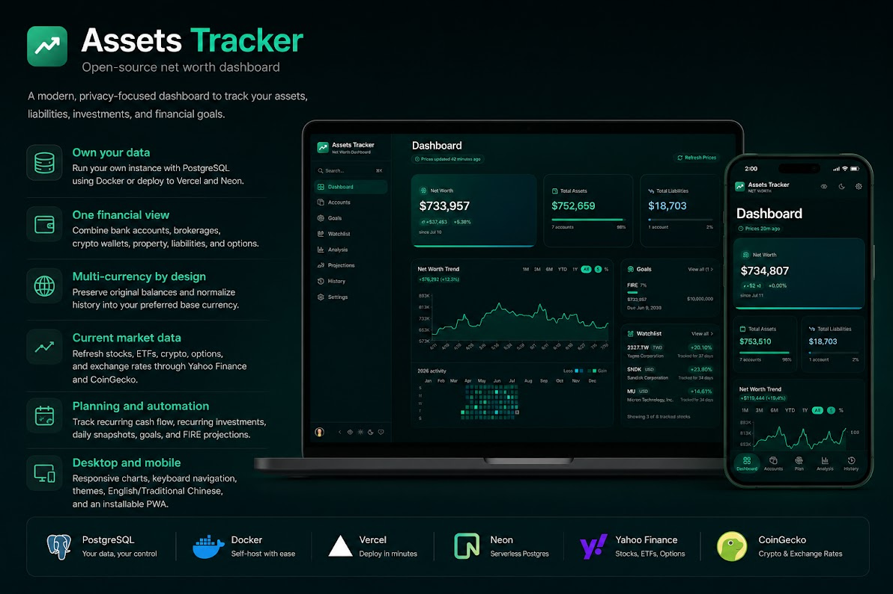

# 💰 資產追蹤器

[](https://github.com/mike840609/asset_tracker/actions/workflows/ci.yml)
[](https://github.com/mike840609/asset_tracker/actions/workflows/e2e.yml?query=branch%3Amaster+event%3Apush)
[](https://github.com/mike840609/asset_tracker/releases/latest)
[](./LICENSE)
[](./CONTRIBUTING.md)
[](https://deepwiki.com/mike840609/asset_tracker)

[English](./README.md) | [繁體中文](./README.zh-TW.md)

可自行部署、支援多幣別的淨資產與投資追蹤工具，讓你在保有資料控制權的同時，集中掌握完整財務狀況。

[線上展示](https://astt.app) · [快速開始](#快速開始) · [部署指南](./docs/DEPLOYMENT.md) · [安全政策](./SECURITY.md) · [參與貢獻](./CONTRIBUTING.md)



## 為什麼選擇資產追蹤器？

- **資料由你掌握** — 可透過 Docker 與 PostgreSQL 自行部署，或使用 Vercel 與 Neon。
- **統一財務視圖** — 整合銀行、券商、加密錢包、不動產、負債與選擇權部位。
- **原生多幣別支援** — 保存原始餘額與幣別，並依偏好基準幣別正規化歷史資料。
- **即時市場資料** — 透過 Yahoo Finance 與 CoinGecko 更新股票、ETF、加密貨幣、選擇權與匯率。
- **規劃與自動化** — 支援定期收支、定期投資、每日快照、財務目標與 FIRE 推估。
- **桌面與行動裝置** — 響應式圖表、鍵盤操作、主題、英文／繁體中文與可安裝 PWA。

使用 Next.js 16、React 19、Prisma 7、PostgreSQL、Tailwind CSS 4 與 NextAuth.js 5 建置。

> Assets Tracker v1 已可穩定供個人自行部署。若要提供其他使用者使用，請先閱讀[資料責任](#資料責任)說明。

## 快速開始

### 必要條件

- Node.js 24
- Docker 與 Docker Compose

### 1. 設定環境變數

```bash
cp .env.example .env
```

替換 `AUTH_SECRET`、`AUTH_SELF_HOST_PASSWORD` 與 `CRON_SECRET` 的預留值。範例中的資料庫連線已可直接搭配內建的本機 PostgreSQL 容器。

自行部署預設使用由 `AUTH_SELF_HOST_PASSWORD` 保護的單一擁有者帳號。非 Vercel 部署可選擇啟用 Google OAuth；請同時設定 `AUTH_GOOGLE_ID` 與 `AUTH_GOOGLE_SECRET`，並將 OAuth 用戶端設定為：

- 已授權的 JavaScript 來源：`http://localhost:3000`
- 已授權的重新導向 URI：`http://localhost:3000/api/auth/callback/google`

正式部署時請改用 HTTPS 網域，並保留相同的 `/api/auth/callback/google` 路徑。Vercel 正式環境仍強制使用 Google OAuth。

### 2. 安裝並初始化

```bash
corepack enable
pnpm install
pnpm db:up
pnpm exec prisma migrate deploy
```

### 3. 啟動應用程式

```bash
pnpm dev
```

開啟 [http://localhost:3000](http://localhost:3000)。使用 `pnpm db:down` 停止本機資料庫。

想以示範資料瀏覽應用程式，可使用一鍵 **Preview Login**（僅限本機開發）登入，並執行 `pnpm seed:demo`。詳見[開發流程](./docs/DEVELOPMENT.md)。

## 正式部署

### Docker Compose

在 `.env` 設定 `NEXT_PUBLIC_APP_URL`、`POSTGRES_PASSWORD` 與正式環境 secrets，然後建立完整的應用程式與 PostgreSQL stack：

```bash
docker compose --profile full up --build -d
```

一次性的 migration service 必須成功完成，應用程式才會啟動。PostgreSQL 資料會保存在 `postgres_data` volume。

### Vercel

建議的託管方式是 Vercel 搭配互相隔離的 Neon Production／Preview 資料庫。環境變數、migration、Preview 隔離、排程、健康檢查與非 Vercel 部署方式請參考[部署指南](./docs/DEPLOYMENT.md)。

## 升級

Docker 部署：

```bash
git pull
docker compose --profile full up --build -d
```

原始碼部署：

```bash
git pull
pnpm install --frozen-lockfile
pnpm exec prisma migrate deploy
pnpm build
```

升級前請先備份資料庫，並查看 [Release Notes](https://github.com/mike840609/asset_tracker/releases)。

## 文件

- [部署與自行託管](./docs/DEPLOYMENT.md)
- [開發流程](./docs/DEVELOPMENT.md)
- [CI 政策](./docs/CI.md)
- [架構說明](./docs/ARCHITECTURE.md)
- [資料庫與 migrations](./docs/DATABASE.md)
- [版本管理](./docs/VERSIONING.md)
- [環境變數參考](./.env.example)

## 開發

```bash
pnpm format:check
pnpm lint
pnpm typecheck
pnpm test:unit
```

歡迎參與貢獻。提出 Pull Request 前請閱讀 [CONTRIBUTING.md](./CONTRIBUTING.md)，社群互動則依循 [Code of Conduct](./CODE_OF_CONDUCT.md)。

## 支援與安全性

可透過 [GitHub Issues](https://github.com/mike840609/asset_tracker/issues) 回報可重現的錯誤或提出功能需求。安全漏洞請依照[安全政策](./SECURITY.md)私下回報，請勿建立公開 Issue。

## 資料責任

每位部署者自行管理 OAuth 憑證、PostgreSQL 資料庫、備份、cron secret 與選用的監控整合。Assets Tracker 是個人財務追蹤軟體，不構成財務、稅務或投資建議。自行部署者需負責資料安全、隱私揭露、法規遵循、備份與存取控制。

## 授權

本專案採用 [MIT License](./LICENSE)，© 2026 Mike Tsai。
